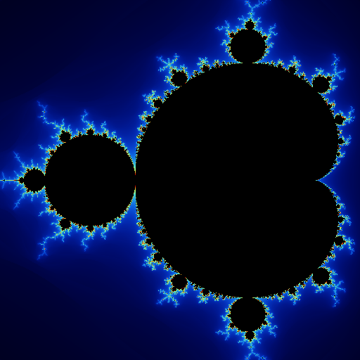
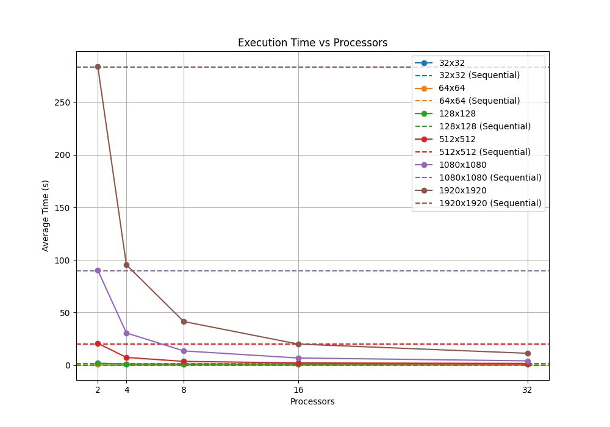
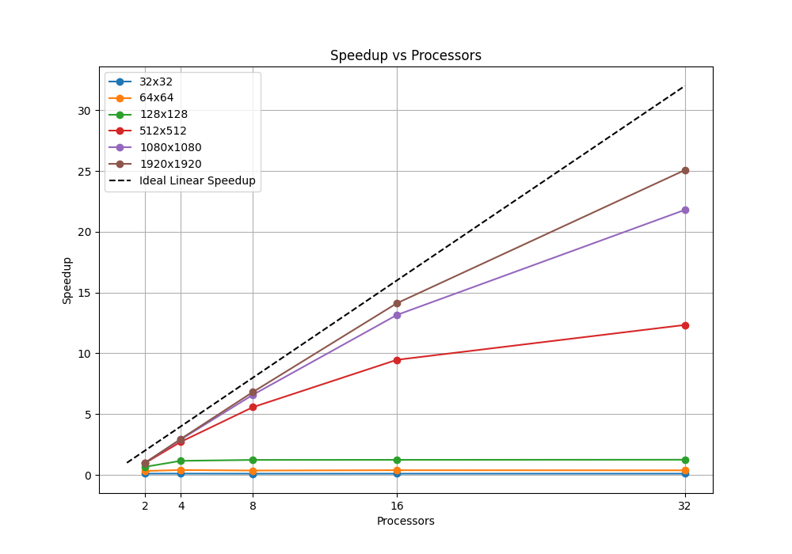
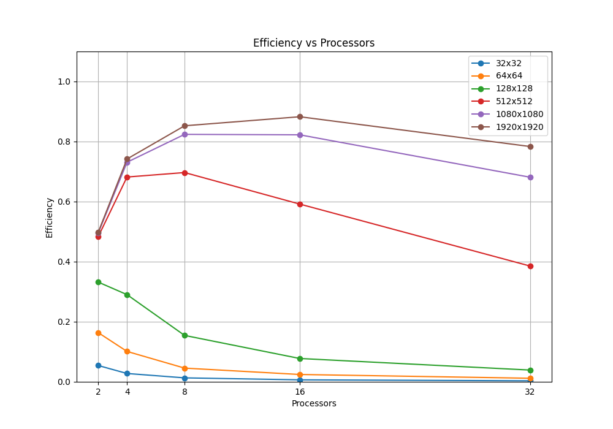

---
# pandoc whitepaper_esp.md -o whitepaper.pdf --pdf-engine=xelatex --include-in-header=header.tex --number-sections
geometry: top=5cm, left=4cm, right=4cm, bottom=4cm
figures-latex-placement: H
---
\begin{flushleft}
{\fontsize{16pt}{16pt}\selectfont \textbf{Renderizado de fractales con MPI}}

Trabajo Integrador Final: Programación Paralela y Distribuida
\end{flushleft}

\begin{flushleft}
{\fontsize{12pt}{12pt}\selectfont \textbf{Autores}}
\end{flushleft}

\begin{flushleft}
\begin{itemize}
  \item Franco Yudica
  \item Martín Farrés
\end{itemize}
\end{flushleft}


*Abstract: Este trabajo presenta el desarrollo de una implementación paralela de renderizado de fractales bidimensionales, mostrando sus diferencias con la versión secuencial. Además se detalla sobre los experimentos realizados para determinar el rendimiento de la aplicación, en conjutno con conclusiones sobre tales resultados.*

*Keywords: Fractals, Mandelbrot Set, Julia Set, Programación paralela, MPI, Números Complejos, Sistemas Dinámicos, Gráficos de Computadora, Evaluación de Resultados.*


# Introducción

El renderizado eficiente de imágenes fractales representa un reto significativo en el ámbito de la computación gráfica, debido a la complejidad matemática involucrada y la alta demanda computacional que implica su visualización detallada. Los fractales, como el conjunto de Mandelbrot o los conjuntos de Julia, se caracterizan por su estructura auto-similar e infinita complejidad, lo que requiere un gran número de cálculos por píxel para generar imágenes precisas y atractivas.

Este informe presenta el desarrollo y análisis de un sistema de renderizado de fractales, implementado utilizando técnicas de paralelización y optimización computacional. El objetivo principal es reducir el tiempo de renderizado, aprovechando al máximo los recursos de hardware disponibles.

En primer lugar, se describe el proceso secuencial de renderizado de fractales, abordando las ecuaciones iterativas involucradas y los criterios de escape utilizados para determinar la convergencia o divergencia de cada punto. Luego, se introduce la versión paralela del sistema, explicando las estrategias utilizadas para distribuir el trabajo entre múltiples hilos o nodos, y las optimizaciones aplicadas para mejorar la eficiencia.

A continuación, se presentan los experimentos realizados para evaluar el rendimiento del sistema, analizando métricas como el speedup, la eficiencia y la escalabilidad en diferentes configuraciones. Se incluyen también comparaciones visuales y tiempos de renderizado, acompañados de una discusión sobre los resultados.

Finalmente, se exponen las conclusiones obtenidas a partir del análisis, resaltando las ventajas y limitaciones del enfoque propuesto. Se sugieren además posibles líneas de mejora, incluyendo la exploración de técnicas avanzadas como el uso de GPUs, algoritmos adaptativos de muestreo y representación dinámica en tiempo real.

# Marco teórico

En esta sección se desarrolla el marco teórico fundamental de los fractales, realizando una breve introducción a la dinámica compleja [\[7\]](#complex-dynamics), conjuntos de Julia y Fatou [\[9\]](#Julia-fatou), fractales de Julia y Mandelbrot [\[2\]](#Mandelbrot), y las técnicas de coloreo de fractales utilizadas en este proyecto.

## Dinámica compleja

La dinámica compleja, también conocida como dinámica holomorfa [\[7\]](#complex-dynamics), es una rama de la matemática que estudia el comportamiento de los sistemas dinámicos [\[8\]](#dynamic-systems) obtenidos mediante la iteración de funciones analíticas en el plano complejo. A diferencia de los sistemas dinámicos en el plano real, la estructura adicional que proporciona la analiticidad en los números complejos introduce una rica variedad de comportamientos geométricos y topológicos que han sido ampliamente estudiados desde principios del siglo XX.

Una función compleja $f:C→C$ se itera generando una secuencia de funciones

$$
f^n(z)=f(f^{n-1}(z))
$$

donde $n \in \mathbb{N}$. El objeto de estudio principal es el conjunto de órbita de un punto $z$, definido como la secuencia de sus imágenes sucesivas bajo iteraciones de $f$. Esta órbita puede exhibir distintos comportamientos: puede tender al infinito, converger a un punto fijo o seguir una trayectoria caótica.

Un ejemplo clásico y fundamental es la función cuadrática:

$$
    f(z) = z²
$$

Aunque simple, esta función exhibe una variedad de comportamientos interesantes dependiendo del punto de partida $z_0$

Por ejemplo:

$$
    Si |z_0| < 1, entonces f^n(z_0) → 0
$$

$$
    Si |z_0| > 1, entonces f^n(z_0) → ∞
$$

$$
    Si |z_0| = 1, entonces f^n(z_0) → 1
$$

## Conjuntos de Julia y Fatou

El estudio de estas órbitas lleva a la clasificación del plano complejo en dos regiones fundamentales:

- El conjunto de Fatou, donde las órbitas tienen un comportamiento estable bajo pequeñas perturbaciones iniciales.
- El conjunto de Julia, que contiene puntos con un comportamiento altamente sensible a las condiciones iniciales, caractarizado por su complejiad fractal.

Estos conjuntos son complementarios y su frontera compartida representa el límite entre estabilidad y caos. En el caso de $f(z) = z²$, el conjunto de Julia es el círculo unitario $|z|=1$, mientras que el conjunto de Fatou está formado por el interior y el exterior de tal círculo.

## Fractal Julia

Los conjuntos de Julia se generan utilizando números complejos. Estos poseen dos componentes, real e imaginaria, y pueden representarse como puntos en un plano bidimensional, lo que permite renderizar el fractal sobre una imagen 2D. Para cada píxel de la imagen, su coordenada $(x,y)$ en el plano se utiliza como entrada en una función recursiva.

El fractal de Julia es un ejemplo clásico de fractal de tiempo de escape, lo que significa que el interés está en determinar si, tras aplicar repetidamente una función compleja, el valor resultante tiende al infinito o no.

La función recursiva que define el conjunto de Julia es:

$$
z_{n+1}=z_n²+c
$$

donde:

- $z_n$​ es el valor complejo en la iteración $n$,
- $z_0$​ es la posición del píxel en el plano complejo, escrita como $z_0=p_x+p_yi$
- $c$ es una constante compleja, $c=c_x+c_yi$, que permanece fija durante toda la generación del fractal.

Está demostrado que si $∣z_n∣>2$, entonces la sucesión diverge (tiende a infinito). En este contexto, el valor 2 se denomina bailout, y es el umbral utilizado para determinar la divergencia. [\[5\]](#fractal-rendering).

## Fractal Mandelbrot

El fractal de Mandelbrot es muy similar al de Julia, ya que también se trata de un fractal de tiempo de escape. La principal diferencia radica en la función recursiva y en los valores iniciales utilizados.

La función que define al conjunto de Mandelbrot es:

$$
z_{n+1} = z_n^2 + p
$$

donde:

- $p$​ es la posición del píxel en el plano complejo, de la forma $p=p_x+p_yi$,

- $z_n$​ inicia en 0, es decir, $z_0=0$, y se itera añadiendo el valor constante $p$​ en cada paso.

Al igual que en el caso del fractal de Julia, el criterio de escape se basa en si $|z_n∣>2$, utilizando el mismo valor de bailout.
[\[2\]](#Mandelbrot), [\[5\]](#fractal-rendering).

## Coloreo de fractales

Existen distintos métodos para colorear fractales, siendo el más básico el blanco y negro. En este esquema, los píxeles cuya posición, al ser utilizada como punto de partida en la iteración del fractal, tienden al infinito, se colorean de blanco. Por el contrario, aquellos que no divergen se colorean de negro.

{ width=60% .center }
  **Figura 1:** *Representación en blanco y negro del conjunto de Mandelbrot.*

Sin embargo, este método binario puede resultar limitado para visualizar la complejidad del sistema dinámico. Por ello, se utilizan técnicas más avanzadas como el coloreo por tiempo de escape (escape time coloring), donde se asignan colores según la cantidad de iteraciones que tarda un punto en escapar de un cierto radio. Esto permite generar imágenes con ricos gradientes de color que reflejan la velocidad de divergencia y destacan la estructura del borde del conjunto. [\[5\]](#fractal-rendering).

{ width=60% .center }
  **Figura 2:** *Representación en escala de grises del conjunto de Mandelbrot.*


Pero también es posible mapear el número de iteraciones a una paleta de colores. Nótese que los puntos pertenecientes al conjunto de Mandelbrot toman un color uniforme, ya que alcanzan el número máximo de iteraciones sin divergir.

{ width=60% .center }
  **Figura 3:** *Mapeo de iteraciones a paleta de colores del conjunto de Mandelbrot.*


En la figura 3 se pueden observar resultados mucho más interesantes. Al mirar con detalle, se aprecian transiciones abruptas entre los colores, un efecto comúnmente denominado *banding* en computación gráfica. Esto se debe a que el mapeo del color se realiza únicamente en función de la cantidad de iteraciones, que es un valor discreto.

{ width=60% .center }
  **Figura 4:** *Mapeo de iteraciones a colores con transición suave.*


Para renderizar la figura 4, se ha utilizado el número de iteraciones, en conjunto con $|z_n|$,  lo cual permite realizar un mapeo continuo a la paleta de colores, eliminando el efecto de *banding*. El desarrollo matemático se encuentra en la referencia [\[5\]](#fractal-rendering).


# Desarrollo

El algoritmo para el desarrollo de dichas imagenes se resume en, la obtencion del color correspondiente segun la formula de fractal aplicada a cada pixel de la imagen. Para la cual se desarrollo una funcion de renderizado **render_block**;

```python
def render_block(x_inicial, y_inicial, ancho, alto):

    for j in range(alto):

        for i in range(ancho):

            pixel_x = x_inicial + i
            pixel_y = y_inicial + j

            # Calcular coordenadas normalizadas [-1.0, 1.0]
            nx, ny = calcular_ndc(pixel_x, pixel_y)

            # Convertir (nx, ny) a coordenadas del mundo (wx, wy) usando la camara
            wx, wy = camera.to_world(nx, ny)

            # Evaluar el fractal, obteniendo las iteraciones normalizadas [0.0, 1.0]
            t = fractal(wx, wy)
            r, g, b = color(t)
            
            # Guardar el color en el buffer
            guardar_buffer(r, g, b, pixel_x, pixel_y)
```

La funcion se encarga del procesamiento de la imagen fractal. Para cada píxel, el algoritmo toma varias muestras con un pequeño desplazamiento aleatorio (antialiasing) para disminuir el ruido obtenido en la imagen final. Luego cada muestra se transforma en coordenadas del mundo con una cámara virtual. Las mismas son evaluadas por **funcion_fractal** para obtener un valor que, luego es transformados a valores rgb utilizando la funcion, **funcion_color**. Finalmente, dichos valores se promedian obteniendo así el color para cada pixel de la imagen.

Para el desarrollo del problema se hicieron dos versiones, secuencial y paralalelo, para observar las diferencias de ambas en terminos de tiempo y costo computacional.

## Secuencial

El código secuencial implementa un enfoque lineal para resolver el problema de renderizado. El algoritmo recibe varios parámetros de configuración, tales como el ancho y alto de la imagen, la posición y el nivel de zoom de la cámara, el tipo de fractal a calcular, entre otros. A partir de esta información, se invoca directamente la función de renderizado, y una vez finalizado el proceso, se guarda la imagen resultante.

El procesamiento es completamente secuencial: cada píxel de la imagen es calculado uno por uno, sin ningún tipo de paralelismo o concurrencia. Esto lo convierte en una implementación sencilla pero poco eficiente para imágenes de alta resolución o fractales complejos.


## Paralelo

Dado que el renderizado de fractales es una tarea altamente demandante en términos computacionales, se exploró una versión paralela del algoritmo con el objetivo de reducir significativamente el tiempo de ejecución.

## Identificación del paralelismo
El renderizado de fractales es un problema naturalmente paralelizable. Cada píxel de la imagen puede calcularse de forma independiente, ya que no requiere información de los píxeles vecinos ni de ningún otro elemento de la imagen. Esta independencia permite dividir la carga de trabajo entre múltiples procesos o hilos de ejecución sin necesidad de sincronización compleja, lo que lo convierte en un caso ideal para aplicar técnicas de paralelismo.

## Secciones secuenciales y paralelizables
El algoritmo presenta tanto secciones secuenciales como paralelizables.

Las secciones secuenciales incluyen la etapa de inicialización, en la cual se configura el entorno de ejecución, se inicializa la biblioteca MPI y se definen las tareas o bloques de la imagen que serán distribuidos a los procesos workers. La etapa de finalización también es secuencial, ya que implica recopilar los bloques renderizados, ensamblar la imagen final y guardarla en disco. Estas etapas requieren acceso centralizado a ciertos recursos y coordinación general, lo que limita su paralelización.

Por otro lado, la sección paralelizable corresponde al renderizado de los bloques de imagen. Dado que cada bloque puede ser procesado de forma independiente, esta etapa se distribuye entre los distintos procesos para acelerar significativamente el tiempo total de ejecución.

## Estrategia de descomposición
El renderizado de fractales representa un caso típico para aplicar una estrategia de descomposición de dominio. Esta técnica consiste en subdividir el dominio del problema, en este caso, la imagen a renderizar, en múltiples subregiones independientes. Concretamente, la imagen se divide en bloques rectangulares, cada uno definido por una tupla de la forma (x, y, ancho, alto), que indica la posición y dimensiones del bloque dentro de la imagen global.

## Modelo de algoritmo paralelo
Se adopta un modelo master-worker. En este esquema, el nodo master se encarga de dividir la imagen en bloques y distribuir el trabajo entre los distintos procesos workers. Además, coordina las solicitudes de tareas, asigna bloques disponibles de forma dinámica y recibe los resultados procesados por cada worker.

Una vez que los bloques son completados, el master se encarga de ensamblar los resultados parciales en un búfer central, que luego se utiliza para generar la imagen final.

### Asignación de tareas y balanceo de carga
Esta aproximación inicial ya demuestra mejoras en el tiempo total de cómputo, aunque revela un desbalanceo de carga cuando algunos bloques requieren más cómputo que otros, siendo esta una característica común en el renderizado de fractales, dejando procesos inactivos mientras otros siguen trabajando.

Por ejemplo, si las ocho tareas tienen duraciones (en ms) [10, 10, 10, 10, 20, 30, 40, 50] y se reparten estáticamente en dos nodos:

- **Nodo1** recibe las cuatro primeras tareas: 10 + 10 + 10 + 10 = 40 ms de trabajo y permanece inactivo los 100 ms restantes.

- **Nodo2** recibe las cuatro últimas: 20 + 30 + 40 + 50 = 140 ms, completando todo el render en 140 ms.

Para resolver este desbalanceo se implementó un balanceo de carga dinámico basado en asignación bajo demanda. En lugar de asignar bloques estáticamente, el master mantiene una cola de tareas y cada worker solicita un nuevo bloque tan pronto como finaliza el anterior. De este modo, el tiempo de inactividad de los procesos se reduce significativamente y se optimiza el uso de los recursos de cómputo. Con la misma serie de duraciones y balanceo dinámico:

- **Nodo1** procesa: 10 + 10 + 10 + 10 + 50 = 90 ms.

- **Nodo2** procesa: 20 + 30 + 40 = 90 ms,

logrando que ambos nodos terminen en 90 ms y minimizando los períodos ociosos.

### Sincronismo - Asincronismo

El sistema implementado utiliza un modelo de comunicación sincrónico. Los mensajes intercambiados entre el nodo master y los workers se gestionan mediante llamadas bloqueantes, donde tanto el emisor como el receptor deben estar sincronizados para que la operación de envío o recepción se complete.

Este enfoque simplifica la lógica de coordinación y garantiza un flujo de ejecución controlado, aunque puede introducir ciertos periodos de espera innecesarios si alguno de los procesos se encuentra inactivo temporalmente.

En este contexto, los beneficios de un modelo asincrónico serían mínimos, ya que el tiempo de comunicación es muy bajo en comparación con el tiempo de cómputo, siendo este último dominado por el proceso de renderizado.

## Pseudocódigo de `master`

```python
def master(num_procs, settings):
    # Crear buffer de imagen
    imagen = crear_buffer_imagen(settings)

    # Dividir imagen en bloques de trabajo
    worker_tasks = dividir_en_tareas(imagen)

    sent = 0
    done = 0

    while done < len(worker_tasks):

        mensaje, origen = mpi_esperar_mensaje()

        if mensaje.tag == "REQUEST":
            if sent < len(worker_tasks):
                tarea = worker_tasks[sent]
                mpi_enviar(tarea, destino=origen, tag="TASK")
                sent += 1
            else:
                mpi_enviar(None, destino=origen, tag="TERMINATE")

        elif mensaje.tag == "RESULT":
            bloque = recibir_mensaje(fuente=origen)
            copiar_bloque_en_buffer(imagen, bloque)
            done += 1

    # Enviar TERMINATE a todos los workers
    for rank in range(1, num_procs):
        mpi_broadcast(tag="TERMINATE")

    # Guardar imagen final
    guardar_imagen(imagen)

```

La función master comienza reservando un búfer para la imagen completa y dividiendo el área de renderizado en bloques de tamaño fijo, que se almacenan en una lista de tareas. A continuación, mantiene dos contadores: uno para las tareas enviadas y otro para las tareas completadas. En un bucle principal, espera mensajes de los masteres; cuando recibe una petición de trabajo, comprueba si aún quedan bloques sin asignar y, en caso afirmativo, envía el siguiente bloque, o bien envía una señal de terminación si ya no hay más. Cuando recibe el resultado de un bloque, copia los píxeles de ese fragmento en la posición correspondiente del búfer global y actualiza el contador de tareas completadas. Este proceso se repite hasta que todas las tareas han sido procesadas, momento en el cual el master envía una señal de terminación a cada worker, detiene el temporizador y muestra el tiempo total de cómputo. Finalmente, invoca al manejador de salida para guardar el búfer como imagen.

## Pseudocódigo de `worker`

```python
def worker(rank, config_imagen, config_fractal, camara):
    while True:

        # Worker listo, solicita tarea
        enviar_mensaje(destino=master, tag="REQUEST")
        mensaje = recibir_mensaje(master)

        if mensaje.tag == "TASK":

            # Recibe el bloque a renderizar
            x, y, ancho, alto = recibir_tarea(fuente=master)
            buffer = crear_buffer(ancho * alto * 3)

            # Renderiza
            render_block(
              buffer, 
              config_imagen, 
              config_fractal, 
              camara, 
              x, 
              y, 
              ancho, 
              alto)

            # Envía el bloque renderizado
            mpi_enviar(
              buffer, 
              destino=master, 
              tag="RESULT")

        elif mensaje.tag == "TERMINATE":
            recibir_senal_terminacion()
            break
```

La función worker arranca enviando al master una petición de tarea y se bloquea hasta recibir una respuesta. Cuando llega una tarea, el worker crea un búfer para la sección asignada, invoca render_block para rellenarlo con los píxeles fractales correspondientes y luego devuelve tanto la descripción de la tarea como su contenido al proceso master. Este ciclo de petición–procesamiento–envío se repite hasta que el master indica la terminación, momento en el cual el worker sale del bucle y finaliza su ejecución.

## Parámetros de Funcionamiento

En esta sección se describen en detalle los comandos de ejecución de la aplicación DistributedFractals, tanto en modo secuencial como distribuido, los parámetros de entrada disponibles y las condiciones necesarias del entorno para su correcto funcionamiento.

### Requisitos y Condiciones del Entorno

Para garantizar la reproducibilidad de los experimentos y el correcto funcionamiento de la plataforma de renderizado distribuido, el entorno de ejecución debe satisfacer los siguientes requisitos hardware, software y de configuración:

- **Sistema Operativo**:
  - Linux (distribuciones basadas Debian GNU/Linux)
- **Herramientas de Construccion**:
  - **CMAKE** version >= 3.14
  - **Compilador C++** con soporte para estandar C++17 (p. ej., `g++ 7.5+, clang++ 8+` )
- **Implementacion MPI**
  - **MPICH** >= 3.2 o **OpenMPI** >= 4.0
  - Variables de entorno configuradas ( `MPI_HOME`, `PATH`, `LD_LIBRARY_PATH`)
  - Acceso a los binarios `mpirun` y/o `mpiexec`
- **Bibliotecas de tiempo de ejecución**
  - Librerías estándar de C++17 (`libstdc++`, `libm`)
  - Librerías MPI (`openmpi-bin`, `openmpi-bin`, `openmpi-common`)

### Instrucción de Construccion


Previo a la ejecuccion, es necesario construir el ejecutable. Para ello, primero instalar las dependencias necesarias:

```bash
sudo apt install openmpi-bin openmpi-bin openmpi-common
```

Luego, dentro de la carpeta `DistributedFractals` ejecutar:

```bash
mkdir build
cd build
cmake ..
make
```

### Parámetros de Entrada


La aplicación admite los siguientes parámetros de entrada:

| Parámetro | Descripción | Valor por defecto |
| ------------------------- | --------------------------------------------------------------- | ----------------- |
| `--width` | Ancho de la imagen (píxeles) | 800 |
| `--height` | Alto de la imagen (píxeles) | 600 |
| `--zoom` | Nivel de zoom | 1.0 |
| `--camera_x` | Posición X del centro de la cámara | 0.0 |
| `--camera_y` | Posición Y del centro de la cámara | 0.0 |
| `--iterations` | Máximo número de iteraciones | 100 |
| `--type` | Identificador de tipo de fractal (0 = Mandelbrot, 1 = Julia, …) | 0 |
| `--color_mode` | Modo de coloreado | 0 |
| `--block_size` | (MPI) Tamaño de bloque en píxeles | 64 |
| `--samples` | (MPI) Número de muestras MSAA | 1 |
| `--output_disk` | Ruta de salida para guardar la imagen en disco | `output.png` |
| `--Julia-cx` | Componente real de la constante $C$ (solo Julia) | 0.285 |
| `--Julia-cy` | Componente imaginaria de la constante $C$ (solo Julia) | 0.01 |


### Ejecución Secuencial


La versión secuencial de la aplicación permite generar imágenes fractales utilizando un único proceso de cómputo. El ejecutable asociado se denomina `sequential`.

```bash
./sequential [OPCIONES]
```

### Ejecución Distribuida (MPI)

La versión paralela aprovecha MPI para repartir bloques de cálculo entre varios procesos. El ejecutable se denomina `fractal_mpi`.

```bash
mpirun -np <N> ./fractal_mpi [OPCIONES]
```

donde `<N>` es el número de procesos MPI.

**Ejemplo de Uso**

```bash
# Con 8 procesos MPI y parámetros personalizados
mpirun -np 8 ./fractal_mpi \
  --width 1080 \
  --height 720 \
  --zoom 1.5 \
  --camera_x -0.7 \
  --camera_y 0.0 \
  --iterations 256 \
  --type 0 \
  --block_size 64 \
  --samples 4 \
  -output_disk mandelbrot_distribuido.png
```

# Diseños de Experimentos

Primero, se plantea un estudio comparativo entre la versión secuencial y la paralela bajo distintas cantidades de nodos, con el fin de evaluar la eficiencia y el speedup.

Luego, se analiza en profundidad el comportamiento de la versión paralela frente a diferentes configuraciones de parámetros.

Es importante aclarar que cada una de las mediciones se basa en el tiempo de ejecución medio, el cuál se obtuvo a partir del promedio de al menos 10 ejecuciones, con el objetivo de asegurar resultados representativos y confiables. Además, ya que el fin de los experimentos radica en el cómputo del buffer con los colores de los pixeles, se ha eliminado de la experimentación el guardado de la imagen.

## Versión secuencial contra paralela

Con el objetivo de realizar una comparación exhaustiva entre la versión secuencial y la versión paralela de la aplicación, se evaluó el rendimiento medio de ambas bajo los siguientes parámetros fijos:

| Parámetro | Valor |
| --------- | ----- |  
| `iterations`           |   $20000$    |
| `samples`              | $4$       |
| `cx`| $-0.7454286$ |
| `cy`| $0.1130089$ |
| `zoom`| $327000$ |
| `color_mode`| $5$ |
| `type`  |       $Mandelbrot$  |
| `block size` (Aplica a la versión paralela) |       $32$  |

Un factor determinante es la resolución de la imagen, especificada por los parámetros width y height. Para simplificar, se utilizaron imágenes cuadradas con $width = height$. Se realizaron ejecuciones para los siguientes tamaños:

|Caso| Resolución|
| ----   |    -    |
| 0 | $128$ x $128$|
| 1 | $512$ x $512$|
| 2 | $1080$ x $1080$|
| 3 | $1920$ x $1920$|

Con el fin de evaluar la **eficiencia** y el **speedup** de la versión paralela, en comparación con la versión secuencial, cada combinación de los parámetros anteriores se ejecutó utilizando diferentes cantidades de procesos MPI: $[2, 4, 8, 16, 32]$.

## Análisis de versión paralela

Existen otros parámetros relevantes, además del tamaño de imagen, que se han considerado fundamentales para el análisis. A continuación, se detallan los parámetros estudiados junto con la justificación de su inclusión y los distintos valores sobre los cuales se realizaron las mediciones:

| Parámetro | Justificación | Valores |
| - | - | - |
| `block_size`| Permite analizar el impacto del tamaño de bloque en el balanceo de carga entre nodos, con el objetivo de encontrar un valor óptimo. |$[2, 4, 8, 16, 32, 64, 128]$
| `iteraciones` | Permite observar cómo afecta el aumento en el número máximo de iteraciones al tiempo de ejecución, y analizar si su comportamiento es lineal, logarítmico o exponencial.| $[100, 500, 1000]$|

Estos experimentos se realizaron con 32 nodos computacionales.

Es importante aclarar que no se realiza una comparación directa entre los fractales de Julia y Mandelbrot. Esto se debe a que el tiempo de ejecución total está determinado por la cantidad de píxeles que alcanzan el número máximo de iteraciones. Ambos fractales poseen subconjuntos de puntos que pertenecen al conjunto en distintas ubicaciones, es decir, puntos que siempre alcanzarán dicho máximo. Compararlos carece de sentido, ya que el resultado depende fuertemente de la posición de la cámara y del nivel de zoom.

## Consideraciones sobre experimentos

Con el fin de garantizar la validez de los resultados, se han tomado en cuenta los siguientes criterios:

- Todas las corridas se realizan sobre la misma configuración de hardware, un cluster de nodos Debian con CPU de cuatro núcleos físicos, los cuales forman un total de 32 nodos computacionales. 

- Misma versión de **OpenMPI (4.1.4)**. 
- Las compilaciones se efectúan con optimización `-O3`.
- Aquellos parámetros que no se hayan especificado, toman su valor por defecto.
- La función de temporización utilizada, `perf_counter()` de la libreria `time` en python, se invoca de manera uniforme en todas las pruebas. 

Con este riguroso control de variables, los resultados obtenidos reflejan de forma confiable el impacto de los factores estudiados sobre el tiempo de renderizado, el speedup y la eficiencia de la versión paralela, permitiendo extraer conclusiones sólidas sobre sus límites de escalabilidad y sus puntos de inflexión en el rendimiento.

# Resultados Obtenidos

En esta sección se presentarán los resultados obtenidos al realizar los experimentos planteados en la sección de diseño de experimentos. Es por este motivo que seguirá la misma estructura planteada anteriormente. Se presentarán tablas de datos y gráficos, los cuales serán analizados en detalle en la sección de análisis de resultados.

## Versión secuencial contra paralela
A continuación se muestra el rendimiento de ambas versiones en función del tamaño de la imagen y la cantidad de nodos utilizados.

### Tamaño de imagen
Se estudió el efecto de modificar la resolución de imagen en el tiempo de ejecución.

#### Tabla de datos de ejecución paralela
Se presenta el tiempo promedio y la desviación estándar para distintas resoluciones y cantidades de nodos.

| Cantidad de nodos | Resolución | Tiempo promedio (s) | Desviación estándar (s) |
| --- | --- | --- | --- |
| 2 | 32x32 |0.7347766071998194 | 0.024293793933656622 |
| 4 | 32x32 |0.7194581487994582 | 0.019995011884794463 |
| 8 | 32x32 |0.7597506460006116 | 0.019692794415084734 |
| 16 | 32x32 |0.755642992799767 | 0.014237480350074726 |
| 32 | 32x32 |0.7530325819996506 | 0.014154650552929655 |
| 2 | 64x64 |0.9698013217999687 | 0.04280733081779699 |
| 4 | 64x64 |0.7844574396993267 | 0.02057444796819635 |
| 8 | 64x64 |0.8701380547001463 | 0.20425526530434057 |
| 16 | 64x64 |0.813580839000133 | 0.02785545076843234 |
| 32 | 64x64 |0.8377403283004241 | 0.030037874078768456 |
| 2 | 128x128 |1.8987524622003549 | 0.02253840710023415 |
| 4 | 128x128 |1.0858486641998752 | 0.027295021328173408 |
| 8 | 128x128 |1.0203170211996622 | 0.026902499139743397 |
| 16 | 128x128 |1.0145710798999061 | 0.022382251243951167 |
| 32 | 128x128 |1.0069084299993847 | 0.019242904410697554 |
| 2 | 512x512 |20.83092403529954 | 0.022270186767527914 |
| 4 | 512x512 |7.38089184599994 | 0.025637281621891578 |
| 8 | 512x512 |3.6114315322007315 | 0.024159854440402008 |
| 16 | 512x512 |2.126211233899812 | 0.03389213149233942 |
| 32 | 512x512 |1.6320069547000458 | 0.03812131381339011 |
| 2 | 1080x1080 |90.4301608312002 | 0.044303374630204846 |
| 4 | 1080x1080 |30.63535752170028 | 0.022529494539971554 |
| 8 | 1080x1080 |13.590946517599514 | 0.014405034421835603 |
| 16 | 1080x1080 |6.808138592400428 | 0.0172290493620024 |
| 32 | 1080x1080 |4.109694875600326 | 0.05180247169371324 |
| 2 | 1920x1920 |284.35179361740086 | 0.028804059407490677 |
| 4 | 1920x1920 |95.44321080139962 | 0.03332558576788434 |
| 8 | 1920x1920 |41.52969608500025 | 0.017873206091913493 |
| 16 | 1920x1920 |20.056586532099754 | 0.025654280626253977 |
| 32 | 1920x1920 |11.296893179300605 | 0.25224913775009544 |

#### Tabla de datos de ejecución secuencial
A modo de comparación, se incluye el tiempo de ejecución para la versión secuencial con cada resolución.

| Resolución | Tiempo promedio (s) | Desviación estándar (s) |
| --- | --- | --- |
| 32x32 | 0.07977260379984731 | 0.00043435765082315455 |
| 64x64 | 0.31759674040004027 | 0.002131164715677036 |
| 128x128 | 1.2609421436000048 | 0.0013148213508798747 |
| 512x512 | 20.132811490099993 | 0.009180779629399193 |
| 1080x1080 | 89.59314089329982 | 0.024588972955427328 |
| 1920x1920 | 283.25439927300033 | 0.04803506827399954 |

#### Tabla de datos de speedup y eficiencia

A partir de los tiempos anteriores, se calculó el Speedup y la Eficiencia de la versión paralela respecto a la secuencial.

| Cantidad de nodos | Resolución | Speedup | Efficiency |
| --- | --- | --- | --- |
| 2 | 32x32 | 0.10856715227211022 | 0.05428357613605511 |
| 4 | 32x32 | 0.11087872718234111 | 0.027719681795585278 |
| 8 | 32x32 | 0.10499840206754242 | 0.013124800258442803 |
| 16 | 32x32 | 0.10556917030922001 | 0.006598073144326251 |
| 32 | 32x32 | 0.10593512911222787 | 0.003310472784757121 |
| 2 | 64x64 | 0.3274863967091476 | 0.1637431983545738 |
| 4 | 64x64 | 0.404861658934322 | 0.1012154147335805 |
| 8 | 64x64 | 0.3649958057626679 | 0.045624475720333485 |
| 16 | 64x64 | 0.3903690022866779 | 0.02439806264291737 |
| 32 | 64x64 | 0.3791111991043436 | 0.011847224972010737 |
| 2 | 128x128 | 0.6640898003833378 | 0.3320449001916689 |
| 4 | 128x128 | 1.1612503520729105 | 0.2903125880182276 |
| 8 | 128x128 | 1.2358336844341005 | 0.15447921055426256 |
| 16 | 128x128 | 1.2428327286092216 | 0.07767704553807635 |
| 32 | 128x128 | 1.252290780404704 | 0.039134086887647 |
| 2 | 512x512 | 0.9664867221436484 | 0.4832433610718242 |
| 4 | 512x512 | 2.727693605348103 | 0.6819234013370258 |
| 8 | 512x512 | 5.57474544667097 | 0.6968431808338712 |
| 16 | 512x512 | 9.46886704815927 | 0.5918041905099544 |
| 32 | 512x512 | 12.336228979980234 | 0.3855071556243823 |
| 2 | 1080x1080 | 0.9907440180332888 | 0.4953720090166444 |
| 4 | 1080x1080 | 2.924501234556748 | 0.731125308639187 |
| 8 | 1080x1080 | 6.592119303632144 | 0.824014912954018 |
| 16 | 1080x1080 | 13.159711671161924 | 0.8224819794476202 |
| 32 | 1080x1080 | 21.80043618936855 | 0.6812636309177672 |
| 2 | 1920x1920 | 0.9961407159404907 | 0.49807035797024535 |
| 4 | 1920x1920 | 2.9677794459618765 | 0.7419448614904691 |
| 8 | 1920x1920 | 6.820526658640936 | 0.852565832330117 |
| 16 | 1920x1920 | 14.122762057225598 | 0.8826726285765999 |
| 32 | 1920x1920 | 25.073654745360415 | 0.783551710792513 |

### Gráficos de rendimiento
A continuación, se presentan gráficos realizados con los datos obtenidos previamente.

{ width=100%  }
  **Figura 5:** *Tiempo medio paralelo y secuencial para cada configuración de cantidada de nodos y resolución de imagen*

{ width=100% }
  **Figura 6:** *Speedup para cada configuración de cantidad de nodos y resolución de imagen*

{ width=100%}
  **Figura 7:** *Eficiencia para cada configuración de cantidad de nodos y resolución de imagen*


## Versión paralela con distintos parámetros
Esta sección explora cómo afectan distintos parámetros internos al rendimiento de la versión paralela.

### Tamaño de bloques
Se evaluó el impacto del tamaño de bloques en el rendimiento del sistema.


### Cantidad de iteraciones
Se estudió el efecto de modificar el número de iteraciones en el tiempo de ejecución.


# Analisis de los Resultados
En esta sección, se realiza un análisis de los resultados obtenidos en la sección anterior.

## Análisis de versión secuencial contra paralela
La *figura 5*, ilustra claramente que existe una mejora significativa al usar el algoritmo paralelo. Se puede observar que las versiones paralelas y secuenciasles toman aproximadamente el mismo tiempo cuando la cantidad de nodos es de 2, ya que solo un procesador trabaja. Luego, a medida que aumenta la cantidad de nodos, el tiempo paralelo decrece logarítmicamente, lo cuál se ve con mayor claridad en grandes resoluciones, especialmente $1920$ x $1920$. Es decir que se pueden obtener los mismos resultados en menor tiempo, tal como era esperado.

En cuanto a la *figura 6*, se observa que existe una relación entre el speedup obtenido y la resolución de la imagen. Si la imagen a renderizar cuenta con muy pocos pixeles, tal como la resolución 128x128, entonces podemos decir que no resulta conviente la utilización del algoritmo paralelo. Esto se debe a la sección secuencial inicial presente en la versión paralela, la cuál corresponde a la inicialización de mpi, a través de `MPI_Init`, toma aproximadamente 350ms. Al aumentar la resolución, aumenta la cantidad de pixeles a renderizar, haciendo que aumente la porción paralelizable, y es por este motivo que el speedup aumenta al renderizar imágenes con más pixeles, se aprovecha el paralelismo.

Al considerar la *figura 7*, se observa que a mayor cantidad de pixeles, es decir, en imágenes de mayor resolución, el valor que toma la eficiencia con dos nodos es de 0.5. Esto no debería sorprender considerando el modelo de algoritmo paralelo que se ha seleccionado, siendo este el master-worker. Al haber dos nodos, uno toma el rol de master y el otro de worker, pero en realidad solo un nodo se encarga del renderizado.
En este contexto, si asumimos que el tiempo secuencial es igual al tiempo de cómputo:
$$
T_{Secuencial}=T_{Paralelo}
$$

Entonces el speeup:

$$
Speedup(2)=T_{Secuencial}/T_{Paralelo}=1
$$
Luego, calculando la eficiencia

$$
Eficiencia(2)=Speedup(2)/N_{nodos}=1/2
$$

Lo cuál demuestra matemáticamente que el valor de eficiencia obtenido con 2 nodos es correcto.

Además, si consideramos las gráficas correspondientes a las distintas resoluciones mostradas en la Figura 7, podemos afirmar que el punto máximo de eficiencia depende tanto de la resolución de la imagen como de la cantidad de nodos utilizados.

Para las versiones de $32 \times 32$, $64 \times 64$ y $128 \times 128$, la eficiencia máxima se alcanza con $N_{\text{Nodos}} = 2$. Esto no debería sorprender, ya que, al observar nuevamente la Figura 6, se puede ver que estas resoluciones mantienen un speedup constante a partir de $N_{\text{Nodos}} = 2$.

Por otro lado, al analizar la resolución de $512 \times 512$, la eficiencia máxima se obtiene con $N_{\text{Nodos}} = 8$, alcanzando un valor de eficiencia de:
$$
Eficiencia(8)=0.6968431808338712
$$
De manera similar, para una resolución de $1080 \times 1080$, la eficiencia máxima también se da con $N_{\text{Nodos}} = 8$, con un valor de:
$$
Eficiencia(8)=0.824014912954018
$$
Finalmente, para una resolución de $1920 \times 1920$, el punto máximo de eficiencia se alcanza con $N_{\text{Nodos}} = 16$, alcanzando:
$$
Eficiencia(16)=0.8826726285765999
$$

Si relacionamos los gráficos de speedup y eficiencia, se puede observar que la relación de orden entre las distintas resoluciones de imagen y su rendimiento se mantiene. Esto se debe a que la eficiencia se calcula a partir de el speedup y la cantidad de nodos, siendo este un factor constante.

Es claro que la versión paralela no alcanzará el speedup superlineal, pero si tiende a alcanzar un speedup lineal. Hay una fuerte relación entre la porción paralelizable, la cuál aumenta al renderizar mayor cantidad de pixeles. 

Sin embargo, existe un umbral a partir del cual no resulta conveniente emplear la versión paralela, ya que los tiempos secuenciales comienzan a representar una proporción significativa en relación con la parte paralelizable del problema.

A pesar de ello, al aumentar el tamaño de la imagen, la utilización de la versión paralela se vuelve cada vez más justificada y eficiente.

## Análisis de versión paralela

En la sección anterior, se ha comprobado que la utilización de la versión paralela brinda excelentes resultados. En esta sección se realizará un análsis con el fin de entender el impacto de los parámetros de tamaño de bloque e iteraciones sobre el tiempo de ejecución.

### Tamaño de los bloques

Como ilusta la figura X, existe una clara relación entre el speedup y el tamaño de los bloques. 

Se observa que para bloques de $2$ x $2$, el speedup se ve acotado. A partir de los 16 nodos. Esto se debe a que contamos con un único nodo master, y al tener una granularidad muy fina, es decir tareas pequeñas y muchas tareas, el programa paralelo pasa mucho tiempo realizando comunicaciones, y el master se satura, convirtiéndose en un cuello de botella.

Los tamaños de $4$ x $4$ y de $8$ x $8$ presentan mejoras en comparación a $2$ x $2$.

La configuración óptima para el tamaño de bloque resulta ser $32$ x $32$, un total de $1024$ pixeles por nodo. Este es el punto en el cuál se logra un banance entre tamaño de bloque, cantidad de nodos y tiempos de comunicaciones.

Nótese que al aumentar el tamaño de los bloques, para $64$ x $64$ y especialmente $128$ x $128$, los tiempos de ejecución aumentan y el speedup se reduce.

En cuanto a la eficiencia, nos encontramos la misma situación presentada en el análisis comparativo anterior cuando $N_{nodos}=2$, siendo incluso más claro.

# Conclusiones

## Planteo de Mejora

(DESARROLLO PENDIENTE)

Aunque el esquema master-worker implementado en DistributedFractals consigue un balanceo de carga dinámico eficiente, el proceso master se convierte en un cuello de botella cuando el sistema escala a un gran número de workers. En la versión actual, el master atiende de forma secuencial dos tareas críticas: recibir bloques de píxeles procesados y copiarlos uno a uno en el búfer global. Cada recepción y posterior copia obliga al master a esperar a que se complete la escritura en memoria antes de poder responder a la siguiente petición de resultados, generando tiempos ociosos en los workers y limitando el speedup alcanzable.

Para mitigar esta contención, proponemos reemplazar la sección monohilo de recepción y ensamblado por una arquitectura multihilo dentro del master. En esta nueva versión, un hilo dedicado gestionaría exclusivamente la recepción de mensajes MPI entrantes, almacenándolos inmediatamente en un pool de buffers preasignados. Mientras tanto, uno o más hilos workers internos realizarían la copia asíncrona de cada bloque al búfer global, operando sobre regiones independientes de la imagen. De esta forma, la llamada a MPI_Recv no bloquearía la escritura en memoria, y los hilos de copia podrían ejecutarse en paralelo con las operaciones de recepción y la lógica de despacho de nuevas tareas.

El diseño multihilo se apoyaría en un patrón productor‑consumidor: el hilo de recepción actúa como productor de unidades de trabajo (bloques recibidos), mientras que el(los) hilo(s) de ensamblado consumen dichos bloques para integrarlos en la imagen. La sincronización entre hilos se coordinaría mediante colas de bloqueo ligero (lock‑free queues) o semáforos de bajo coste, garantizando seguridad de memoria y eliminando la latencia asociada a locks pesados. Asimismo, introduciendo doble búfer —un búfer en uso por la copia mientras otro está siendo llenado—, se conseguiría un solapamiento aún mayor entre comunicación y cómputo.

Adicionalmente, convendría explorar el uso de comunicaciones MPI no bloqueantes (MPI_Irecv/MPI_Isend), de manera que los hilos puedan iniciar recepciones anticipadas y comprobar su finalización de forma periódica, en vez de depender de bloqueos completos. Este enfoque híbrido MPI+threads aprovecha la independencia de los bloques fractales para maximizar el solapamiento, reduce los tiempos de espera del master y permite escalar más eficientemente al incrementar el número de procesos y el tamaño de los problemas. En conjunto, estas modificaciones prometen reducir drásticamente los intervalos ociosos en los workers y acercar el rendimiento observado al límite teórico dictado por la ley de Amdahl.

# Bibliografía

**[1]** https://solarianprogrammer.com/2013/02/28/Mandelbrot-set-cpp-11/

**[2]** <a id="Mandelbrot"></a> https://en.wikipedia.org/wiki/Mandelbrot_set

**[3]** https://youtu.be/FFftmWSzgmk?si=KPTdCiAoU7zeQ5VQ

**[4]** https://youtu.be/LqbZpur38nw?si=QAimXxeVIlmIqf3I

**[5]** <a id="fractal-rendering"></a> https://cglearn.eu/pub/advanced-computer-graphics/fractal-rendering

**[6]** https://www.mpi-forum.org/docs/mpi-4.1/mpi41-report.pdf

**[7]** <a id="complex-dynamics"></a>https://en.wikipedia.org/wiki/Complex_dynamics

**[8]** <a id="dynamic-systems"></a>https://es.wikipedia.org/wiki/Sistema_din%C3%A1mico

**[9]** <a id="Julia-fatou"></a>https://en.wikipedia.org/wiki/Julia_set 

## Proyectos de referencia

**[8]** https://github.com/lucaszm7/Mandel2Us

**[9]** https://github.com/Sudo-Rahman/Fractalium
