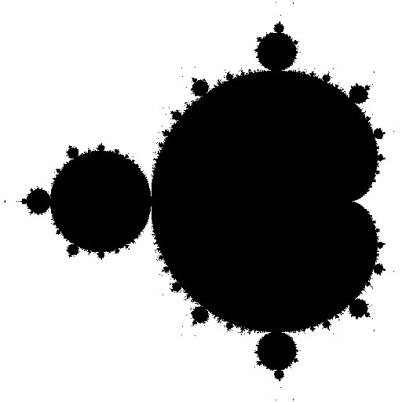
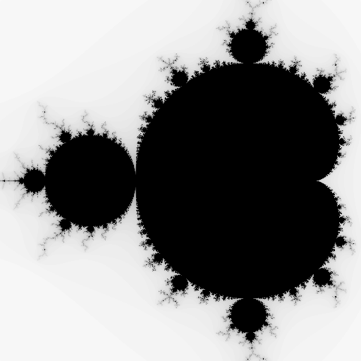
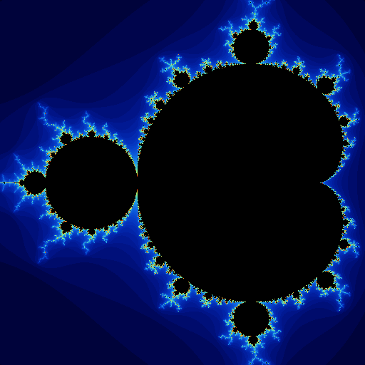

# Renderizado de fractales con MPI

Franco Yudica, Martín Farrés

## Abstract

Este trabajo presenta el desarrollo de una implementación paralela de renderizado de fractales bidimensionales, mostrando sus diferencias con la versión secuencial. Además se detalla sobre los experimentos realizados para determinar el rendimiento de la aplicación, en conjutno con conclusiones sobre tales resultados.

## Índice

- [Introducción](#introducción)
- [Marco teórico](#marco-teórico)
  - [Dinámica compleja](#dinámica-compleja)
  - [Conjuntos de Julia y Fatou](#conjuntos-de-julia-y-fatou)
  - [Fractal Julia](#fracal-julia)
  - [Fractal Mandelbrot](#fracal-mandelbrot)
  - [Coloreo de fractales](#coloreo-de-fractales)
- [Desarrollo](#desarrollo)
  - [Secuencial](#secuencial)
  - [Paralelo](#paralelo)
  - [Parametros de Funcionamiento](#parámetros-de-funcionamiento)
- [Estudio Experimental](#estudio-experimental)
  - [Hipotesis Experimentales](#hipotesis-experimentales)
  - [Diseño de Experimentos](#diseños-de-experimentos)
  - [Factores y variables de control experimentales](#factores-y-variables-de-control-experimentales)
- [Resultados Obtenidos](#resultados-obtenidos)
- [Analisis de los Resultados](#analisis-de-los-resultados)
- [Conclusiones](#conclusiones)
- [Bibliografía](#bibliografía)

## Introducción

El renderizado eficiente de imágenes fractales representa un reto significativo en el ámbito de la computación gráfica, debido a la complejidad matemática involucrada y la alta demanda computacional que implica su visualización detallada. Los fractales, como el conjunto de Mandelbrot o los conjuntos de Julia, se caracterizan por su estructura auto-similar e infinita complejidad, lo que requiere un gran número de cálculos por píxel para generar imágenes precisas y atractivas.

Este informe presenta el desarrollo y análisis de un sistema de renderizado de fractales, implementado utilizando técnicas de paralelización y optimización computacional. El objetivo principal es reducir el tiempo de renderizado, aprovechando al máximo los recursos de hardware disponibles.

En primer lugar, se describe el proceso secuencial de renderizado de fractales, abordando las ecuaciones iterativas involucradas y los criterios de escape utilizados para determinar la convergencia o divergencia de cada punto. Luego, se introduce la versión paralela del sistema, explicando las estrategias utilizadas para distribuir el trabajo entre múltiples hilos o nodos, y las optimizaciones aplicadas para mejorar la eficiencia.

A continuación, se presentan los experimentos realizados para evaluar el rendimiento del sistema, analizando métricas como el speedup, la eficiencia y la escalabilidad en diferentes configuraciones. Se incluyen también comparaciones visuales y tiempos de renderizado, acompañados de una discusión sobre los resultados.

Finalmente, se exponen las conclusiones obtenidas a partir del análisis, resaltando las ventajas y limitaciones del enfoque propuesto. Se sugieren además posibles líneas de mejora, incluyendo la exploración de técnicas avanzadas como el uso de GPUs, algoritmos adaptativos de muestreo y representación dinámica en tiempo real.

## Marco teórico

### Dinámica compleja

La dinámica compleja, también conocida como dinámica holomorfa [\[7\]](#complex-dynamics), es una rama de la matemática que estudia el comportamiento de los sistemas dinámicos [\[8\]](#dynamic-systems) obtenidos mediante la iteración de funciones analíticas en el plano complejo. A diferencia de los sistemas dinámicos en el plano real, la estructura adicional que proporciona la analiticidad en los números complejos introduce una rica variedad de comportamientos geométricos y topológicos que han sido ampliamente estudiados desde principios del siglo XX.

Una función compleja $f:C→C$ se itera generando una secuencia de funciones

$$
f^n(z)=f(f^{n-1}(z))
$$

donde $n \in \mathbb{N}$. El objeto de estudio principal es el conjunto de órbita de un punto $z$, definido como la secuencia de sus imágenes sucesivas bajo iteraciones de $f$. Esta órbita puede exhibir distintos comportamientos: puede tender al infinito, converger a un punto fijo o seguir una trayectoria caótica.

Un ejemplo clásico y fundamental es la función cuadrática:

$$
    f(z) = z²
$$

Aunque simple, esta función exhibe una variedad de comportamientos interesantes dependiendo del punto de partida $z_0$

Por ejemplo:

$$
    Si |z_0| < 1, entonces f^n(z_0) → 0
$$

$$
    Si |z_0| > 1, entonces f^n(z_0) → ∞
$$

$$
    Si |z_0| = 1, entonces f^n(z_0) → 1
$$

### Conjuntos de Julia y Fatou

El estudio de estas órbitas lleva a la clasificación del plano complejo en dos regiones fundamentales:

- El conjunto de Fatou, donde las órbitas tienen un comportamiento estable bajo pequeñas perturbaciones iniciales.
- El conjunto de Julia, que contiene puntos con un comportamiento altamente sensible a las condiciones iniciales, caractarizado por su complejiad fractal.

Estos conjuntos son complementarios y su frontera compartida representa el límite entre estabilidad y caos. En el caso de $f(z) = z²$, el conjunto de julia es el círculo unitario $|z|=1$, mientras que el conjunto de Fatou está formado por el interior y el exterior de tal círculo.

### Fracal Julia

Los conjuntos de Julia se generan utilizando números complejos. Estos poseen dos componentes, real e imaginaria, y pueden representarse como puntos en un plano bidimensional, lo que permite renderizar el fractal sobre una imagen 2D. Para cada píxel de la imagen, su coordenada $(x,y)$ en el plano se utiliza como entrada en una función recursiva.

El fractal de Julia es un ejemplo clásico de fractal de tiempo de escape, lo que significa que el interés está en determinar si, tras aplicar repetidamente una función compleja, el valor resultante tiende al infinito o no.

La función recursiva que define el conjunto de Julia es:

$$
z_{n+1}=z_n²+c
$$

donde:

- $z_n$​ es el valor complejo en la iteración $n$,
- $z_0$​ es la posición del píxel en el plano complejo, escrita como $z_0=p_x+p_yi$
- $c$ es una constante compleja, $c=c_x+c_yi$, que permanece fija durante toda la generación del fractal.

Está demostrado que si $∣z_n∣>2$, entonces la sucesión diverge (tiende a infinito). En este contexto, el valor 2 se denomina bailout, y es el umbral utilizado para determinar la divergencia. [\[5\]](#fractal-rendering).

### Fracal Mandelbrot

El fractal de Mandelbrot es muy similar al de Julia, ya que también se trata de un fractal de tiempo de escape. La principal diferencia radica en la función recursiva y en los valores iniciales utilizados.

La función que define al conjunto de Mandelbrot es:

$$
z_{n+1} = z_n^2 + p
$$

donde:

- $p$​ es la posición del píxel en el plano complejo, de la forma $p=p_x+p_yi$,

- $z_n$​ inicia en 0, es decir, $z_0=0$, y se itera añadiendo el valor constante $p$​ en cada paso.

Al igual que en el caso del fractal de Julia, el criterio de escape se basa en si $|z_n∣>2$, utilizando el mismo valor de bailout.
[\[2\]](#mandelbrot), [\[5\]](#fractal-rendering).

### Coloreo de fractales

Existen distintos métodos para colorear fractales, siendo el más básico el blanco y negro. En este esquema, los píxeles cuya posición, al ser utilizada como punto de partida en la iteración del fractal, tienden al infinito, se colorean de blanco. Por el contrario, aquellos que no divergen se colorean de negro.



<p align="center"><b>Figura 1:</b> Representación en blanco y negro del conjunto de Mandelbrot.</p>

Sin embargo, este método binario puede resultar limitado para visualizar la complejidad del sistema dinámico. Por ello, se utilizan técnicas más avanzadas como el coloreo por tiempo de escape (escape time coloring), donde se asignan colores según la cantidad de iteraciones que tarda un punto en escapar de un cierto radio. Esto permite generar imágenes con ricos gradientes de color que reflejan la velocidad de divergencia y destacan la estructura del borde del conjunto. [\[5\]](#fractal-rendering).



<p align="center"><b>Figura 2:</b> Representación en escala de grises del conjunto de Mandelbrot.</p>

Pero también es posible mapear el número de iteraciones a una paleta de colores. Nótese que los puntos pertenecientes al conjunto de Mandelbrot toman un color uniforme, ya que alcanzan el número máximo de iteraciones sin divergir.



<p align="center"><b>Figura 3:</b> Mapeo de iteraciones a paletea de colores del conjunto de Mandelbrot.</p>

Es interesante observar que se produce un efecto de banding, claramente visible en la Figura 3, ya que los puntos divergentes con igual número de iteraciones toman el mismo color.

## Desarrollo

El algoritmo para el desarrollo de dichas imagenes se resume en, la obtencion del color correspondiente segun la formula de fractal aplicada a cada pixel de la imagen. Para la cual se desarrollo una funcion de renderizado **render_block**;

```plaintext
FUNCION render_block(buffer, config_fractal)

    Obtener funcion_fractal desde config_fractal
    Obtener funcion_color desde config_fractal

    PARA cada fila j desde 0 hasta alto
        PARA cada columna i desde 0 hasta ancho

            pixel_x = x_inicial + i
            pixel_y = y_inicial + j

            Inicializar r, g, b en 0

            PARA cada muestra de antialiasing
                Generar un pequeño desplazamiento aleatorio en x y y

                Calcular coordenadas normalizadas nx, ny

                Convertir (nx, ny) a coordenadas del mundo (wx, wy) usando la camara

                t = funcion_fractal(wx, wy)

                (sample_r, sample_g, sample_b) = funcion_color(t)

                Acumular los valores en r, g, b
            FIN PARA

            Promediar r, g, b y convertir a valores entre 0 y 255

            Guardar el color en el buffer
        FIN PARA
    FIN PARA

FIN FUNCION
```

La funcion se encarga del procesamiento de la imagen fractal. Para cada píxel, el algoritmo toma varias muestras con un pequeño desplazamiento aleatorio (antialiasing) para disminuir el ruído obtenido en la imagen final. Luego cada muestra se transforma en coordenadas del mundo con una cámara virtual. Las mismas son evaluadas por **funcion_fractal** para obtener un valor que, luego es transformados a valores rgb utilizando la funcion, **funcion_color**. Finalmente, dichos valores se promedian obteniendo así el color para cada pixel de la imagen.

Para el desarrollo del problema se hicieron dos versiones, secuencial y paralalelo, para observar las diferencias de ambas en terminos de tiempo y costo computacional.

### Secuencial

El codigo secuencial desarrollado toma un acercamiento lineal al problema. El algoritmo espera ciertos paremetros de configuracion tales como, alto y ancho de la imagen, posicion de la camara y zoom de la misma, que tipo de calculo fractal a utilizar, entre otros. El mismo invoca a la funcion de renderizado para luego guardar la imagen resultante.

### Paralelo

La solución paralela aprovecha la independencia de cada bloque de píxeles para ejecutar el renderizado de forma concurrente.Sin embargo, es importante notar la seccion no paralelizable, la inicializacion de los procesos con el metodo `MPI_INIT()`.Para el resto del codigo paralelizable, se adopta un esquema maestro–trabajador: el proceso maestro divide la imagen en bloques, asigna una division equitativa del cómputo, coordina las solicitudes de trabajo de los procesos esclavos y ensambla los resultados parciales en el búfer central.

Esta aproximación inicial ya demuestra mejoras en el tiempo total de cómputo, aunque revela un desbalanceo de carga cuando algunos bloques requieren más cómputo que otros, dejando procesos inactivos mientras otros siguen trabajando.

Por ejemplo, si las ocho tareas tienen duraciones (en ms) [10, 10, 10, 10, 20, 30, 40, 50] y se reparten estáticamente en dos nodos:

- **Nodo1** recibe las cuatro primeras tareas: 10 + 10 + 10 + 10 = 40 ms de trabajo y permanece inactivo los 100 ms restantes.

- **Nodo2** recibe las cuatro últimas: 20 + 30 + 40 + 50 = 140 ms, completando todo el render en 140 ms.

Para resolver este desbalanceo se implementó un balanceo de carga dinámico basado en demanda. En lugar de asignar bloques estáticamente, el maestro mantiene una cola de tareas y cada trabajador solicita un nuevo bloque tan pronto como finaliza el anterior. De este modo, el tiempo de inactividad de los procesos se reduce significativamente y se optimiza el uso de los recursos de cómputo. Con la misma serie de duraciones y balanceo dinámico:

- **Nodo1** procesa: 10 + 10 + 10 + 10 + 50 = 90 ms.

- **Nodo2** procesa: 20 + 30 + 40 = 90 ms,

logrando que ambos nodos terminen en 90 ms y minimizando los períodos ociosos.

## Pseudocódigo de `master`

```plaintext
FUNCION master(num_procs, settings)

    CREAR buffer de imagen

    DIVIDIR imagen en tareas (bloques) → lista worker_tasks

    sent ← 0
    done ← 0

    MIENTRAS done < número_de_tareas
        ESPERAR mensaje MPI

        SI mensaje == REQUEST ENTONCES
            SI hay tareas sin enviar ENTONCES
                ENVIAR siguiente tarea
                sent ← sent + 1
            SINO
                ENVIAR TERMINATE
            FIN SI

        SINO SI mensaje == RESULT ENTONCES
            RECIBIR bloque procesado
            COPIAR bloque en buffer principal
            done ← done + 1
        FIN SI
    FIN MIENTRAS

    ENVIAR TERMINATE a todos los workers

    DETENER temporizador e IMPRIMIR duración

    GUARDAR buffer como imagen final

FIN FUNCION
```

La función master comienza reservando un búfer para la imagen completa y dividiendo el área de renderizado en bloques de tamaño fijo, que se almacenan en una lista de tareas. A continuación, mantiene dos contadores: uno para las tareas enviadas y otro para las tareas completadas. En un bucle principal, espera mensajes de los trabajadores; cuando recibe una petición de trabajo, comprueba si aún quedan bloques sin asignar y, en caso afirmativo, envía el siguiente bloque, o bien envía una señal de terminación si ya no hay más. Cuando recibe el resultado de un bloque, copia los píxeles de ese fragmento en la posición correspondiente del búfer global y actualiza el contador de tareas completadas. Este proceso se repite hasta que todas las tareas han sido procesadas, momento en el cual el maestro envía una señal de terminación a cada trabajador, detiene el temporizador y muestra el tiempo total de cómputo. Finalmente, invoca al manejador de salida para guardar el búfer como imagen.

## Pseudocódigo de `worker`

```plaintext
FUNCION worker(rank, config_imagen, config_fractal, camara)

    MIENTRAS verdadero
        ENVIAR mensaje REQUEST al maestro

        ESPERAR mensaje del maestro con cualquier tag

        SI mensaje.tag == TASK ENTONCES
            RECIBIR tarea (x, y, ancho, alto) del maestro
            CREAR buffer de salida de tamaño (ancho * alto * 3)
            LLAMAR render_block(buffer, config_imagen, config_fractal, camara, x, y, ancho, alto)
            ENVIAR tarea al maestro con tag RESULT
            ENVIAR buffer al maestro con tag RESULT

        SINO SI mensaje.tag == TERMINATE ENTONCES
            RECIBIR señal de terminación
            ROMPER el bucle

        FIN SI
    FIN MIENTRAS

FIN FUNCION
```

La función worker arranca enviando al maestro una petición de tarea y se bloquea hasta recibir una respuesta. Cuando llega una tarea, el trabajador crea un búfer para la sección asignada, invoca render_block para rellenarlo con los píxeles fractales correspondientes y luego devuelve tanto la descripción de la tarea como su contenido al proceso maestro. Este ciclo de petición–procesamiento–envío se repite hasta que el maestro indica la terminación, momento en el cual el trabajador sale del bucle y finaliza su ejecución.

## Parámetros de Funcionamiento

En esta sección se describen en detalle los comandos de ejecución de la aplicación DistributedFractals, tanto en modo secuencial como distribuido, los parámetros de entrada disponibles y las condiciones necesarias del entorno para su correcto funcionamiento.

### Requisitos y Condiciones del Entorno

Para garantizar la reproducibilidad de los experimentos y el correcto funcionamiento de la plataforma de renderizado distribuido, el entorno de ejecución debe satisfacer los siguientes requisitos hardware, software y de configuración:

- **Sistema Operativo**:
  - Linux (distribuciones basadas Debian GNU/Linux)
- **Herramientas de Construccion**:
  - **CMAKE** version >= 3.14
  - **Compilador C++** con soporte para estandar C++17 (p. ej., `g++ 7.5+, clang++ 8+` )
- **Implementacion MPI**
  - **MPICH** >= 3.2 o **OpenMPI** >= 4.0
  - Variables de entorno configuradas ( `MPI_HOME`, `PATH`, `LD_LIBRARY_PATH`)
  - Acceso a los binarios `mpirun` y/o `mpiexec`
- **Bibliotecas de tiempo de ejecución**
  - Librerías estándar de C++17 (`libstdc++`, `libm`)
  - Librerías MPI (`openmpi-bin`, `openmpi-bin`, `openmpi-common`)

### Instruccion de Construccion

Previo a la ejecuccion, es necesario construir el ejecutable. Para ello, primero instalar las dependencias necesarias:

```bash
sudo apt install openmpi-bin openmpi-bin openmpi-common
```

Luego, dentro de la carpeta `DistributedFractals` ejecutar:

```bash
mkdir build
cd build
cmake ..
make
```

### Ejecuccion Secuencial

La versión secuencial de la aplicación permite generar imágenes fractales utilizando un único proceso de cómputo. El ejecutable asociado se denomina `sequential`.

```bash
./sequential [OPCIONES]
```

#### **Opciones Principales**

- `-od, --output_disk <ruta>`
  Guarda la imagen resultante en el sistema de archivos. Si no se especifica `<ruta>`, el nombre por defecto es `output.png`.
- `-w, --width <int>`
  Ancho de la imagen en píxeles (p.ej., 1920).
- `-h, --height <int>`
  Alto de la imagen en píxeles (p.ej., 1080).
- `-z, --zoom <float>`
  Nivel de zoom aplicado al fractal (valor ≥ 1.0).
- `-cx, --camera_x <float>`
  Coordenada X del centro de la cámara en el plano complejo.
- `-cy, --camera_y <float>`
  Coordenada Y del centro de la cámara en el plano complejo.
- `-i, --iterations <int>`
  Número máximo de iteraciones por píxel (p.ej., 512).
- `-t, --type <int>`
  Tipo de fractal: 0 = Mandelbrot, 1 = Julia, etc.
- `--color_mode <int>`
  Modo de coloreado según el número de iteraciones.
- `--julia-cx <float>`
  Componente real de la constante C para el conjunto de Julia.
- `--help`
  Muestra un mensaje de ayuda completo.

### Ejecuccion Distribuida (MPI)

La versión paralela aprovecha MPI para repartir bloques de cálculo entre varios procesos. El ejecutable se denomina `fractal_mpi`.

```bash
mpirun -np <N> ./fractal_mpi [OPCIONES]
```

donde `<N>` es el número de procesos MPI.

#### **Ejemplo de Uso**

```bash
## Con 8 procesos MPI y parámetros personalizados
mpirun -np 8 ./fractal_mpi \
  -w 1080 -h 720 \
  -z 1.5 \
  -cx -0.7 -cy 0.0 \
  -i 256 \
  -t 0 \
  -b 64 \
  -s 4 \
  -od mandelbrot_distribuido.png
```

#### **Opciones adicionales específicas para MPI**

- `-b, --block_size <int>`
  Tamaño (en píxeles) de cada bloque de tareas que envía el proceso maestro a los trabajadores (p.ej., 32, 64 o 128).
- `-s, --samples <int>`
  Número de muestras MSAA para antialiasing en cada bloque.

Otras opciones (-w, -h, -z, etc.) tienen el mismo comportamiento que en la versión secuencial.

### Parametros de Entrada

La aplicación admite los siguientes parámetros de entrada, ya sean en ejecución secuencial o distribuida:
| Parámetro | Descripción | Valor por defecto |
| ------------------------- | --------------------------------------------------------------- | ----------------- |
| `--width`, `-w` | Ancho de la imagen (píxeles) | 800 |
| `--height`, `-h` | Alto de la imagen (píxeles) | 600 |
| `--zoom`, `-z` | Nivel de zoom | 1.0 |
| `--camera_x`, `-cx` | Posición X del centro de la cámara | 0.0 |
| `--camera_y`, `-cy` | Posición Y del centro de la cámara | 0.0 |
| `--iterations`, `-i` | Máximo número de iteraciones | 100 |
| `--type`, `-t` | Identificador de tipo de fractal (0 = Mandelbrot, 1 = Julia, …) | 0 |
| `--color_mode` | Modo de coloreado | 0 |
| `--julia-cx` | Componente real de la constante $C$ (solo Julia) | 0.285 |
| `--julia-cy` | Componente imaginaria de la constante $C$ (solo Julia) | 0.01 |
| `--block_size`, `-b` | (MPI) Tamaño de bloque en píxeles | 64 |
| `--samples`, `-s` | (MPI) Número de muestras MSAA | 1 |
| `--output_disk`, `-od` | Ruta de salida para guardar la imagen en disco | `output.png` |
| `--output_network`, `-on` | Dirección IP y puerto para envío por TCP | `0.0.0.0:5001` |
| `--help` | Muestra la ayuda en pantalla | — |

#### **Parametros de configuracion recomendados**

## Estudio Experimental

### Hipotesis Experimentales

Para el diseños de experimentos se plantean las siguientes hipotesis a evaluar:

1. **La ejecuccion en Paralelo va retornar un speedup logaritmico:**

   Se espera que al incorporar paralelismo se obtenga un speedup notable; sin embargo, al agregar más procesos se vuelva notable el cuello de botella del proceso master para manejar un gran conjunto de nodos workers. Incluso no sería de extrañar observar una baja en el rendimiento a medida que se aumenten exponencialmente los procesos.

2. **Relacion de tamaño de bloque con,**

   - cantidad de procesos:
     Se estima encontrar una relacion optima entre la cantidad de procesos y la cantidad de tareas en las que se divide la imagen (tamaño de imagen / tamaño de bloque). Nuevamente, basandonos en la teoría, a medida que tenemos una relacion de 1 a 1 de tareas por nodos, es esperable obtener un gran porcentaje de tiempo oscioso. Mientras que, al disminuir demasiado el tamaño de bloque podría generar una disminucion en la eficiencia del programa al aumentar significativamente los tiempos de ejecuccion.

   - tamaño de imagen:
     A diferencia de la relacion mencionada previamente, no se espera encontrar una relacion clara entre tamaño de bloque y tamaño de imagen. Pero, basandonos en la ley de Gustafson-Barsis, se espera que a medida que manejemos imagen de envergadura el porcentaje de tiempo no paralelizable se torne insignificante. Obteniendo así, una mayor eficiencia a medida que aumenta el tamaño de la imagen.

3. **Comparacion entre Mandelbrot y Julia Set**

   Se espera no encontrar ninguna diferencia significativa entre ambos conjuntos, ya que el computo del programa no recae en el calculo mismo de las funciones; sino que, en la cantidad de iteraciones maximas.

### Diseños de Experimentos

Con el fin de evaluar de manera rigurosa las hipótesis planteadas, se adoptó un diseño factorial completo en el que se combinan de forma sistemática las variaciones de número de procesos MPI, tamaño de bloque, resolución de imagen, número máximo de iteraciones y tipo de fractal. Cada configuración experimental consiste en ejecutar la aplicación tanto en modo secuencial (un único proceso) como en paralelo —con 2, 4, 8 y 16 procesos— para cada par de valores de bloque y resolución seleccionados. De este modo, se generan réplicas suficientes para aislar el efecto de cada factor y sus interacciones, asegurando un muestreo estadísticamente representativo. Cada celda del diseño factorial se repite tres veces, descartando aquellas corridas que difieran en más de un 5 % de la media y computando, finalmente, los valores de tiempo de ejecución, speedup y eficiencia promedio.

### Factores y variables de control experimentales

Los factores independientes cuyo impacto se investiga incluyen, en primer lugar, el número de procesos MPI, evaluado en los niveles de 1, 2, 4, 8 y 16, con el objetivo de medir la relación entre concurrencia y rendimiento. En segundo término, el tamaño de bloque (block_size) se modula entre 32, 64 y 128 píxeles para determinar su influencia en la granularidad de las tareas y la sobrecarga de comunicación. La resolución de la imagen se fijó en tres casos representativos —800 × 600, 1920 × 1080 y 3840 × 2160—, atendiendo a la hipótesis de Gustafson–Barsis sobre la escalabilidad con el problema, mientras que el número máximo de iteraciones por píxel se estableció en 100, 500 y 1 000 para variar la complejidad computacional de cada punto. Finalmente, se compara el cálculo de fractales de tipo Mandelbrot frente a Julia, con el fin de verificar si el tipo de función iterativa afecta de manera apreciable el rendimiento global más allá de la carga por iteración.

Para garantizar la validez interna, todas las corridas se realizan sobre la misma configuración de hardware —un nodo Linux con CPU de cuatro núcleos físicos y 16 GB de RAM— y la misma versión de **OpenMPI (4.0)**. Las compilaciones se efectúan con optimización -O3 y se limpia el directorio de construcción antes de cada serie de mediciones. Los parámetros de zoom, posición de cámara y modo de coloreado permanecen constantes (zoom=1.0, camera_x=0.0, camera_y=0.0, color_mode=0) y se emplea una semilla fija para el muestreo aleatorio en MSAA. La función de temporización utilizada, `perf_counter()` de la libreria `time `en python, se invoca de manera uniforme en todas las pruebas. Con este riguroso control de variables, los resultados obtenidos reflejan de forma confiable el impacto de los factores estudiados sobre el tiempo de renderizado, el speedup y la eficiencia de `DistributedFractals`, permitiendo extraer conclusiones sólidas sobre sus límites de escalabilidad y sus puntos de inflexión en el rendimiento.

## Resultados Obtenidos

## Analisis de los Resultados

## Conclusiones

### Planteo de Mejora

Aunque el esquema maestro–trabajador implementado en DistributedFractals consigue un balanceo de carga dinámico eficiente, el proceso maestro se convierte en un cuello de botella cuando el sistema escala a un gran número de trabajadores. En la versión actual, el maestro atiende de forma secuencial dos tareas críticas: recibir bloques de píxeles procesados y copiarlos uno a uno en el búfer global. Cada recepción y posterior copia obliga al maestro a esperar a que se complete la escritura en memoria antes de poder responder a la siguiente petición de resultados, generando tiempos ociosos en los trabajadores y limitando el speedup alcanzable.

Para mitigar esta contención, proponemos reemplazar la sección monohilo de recepción y ensamblado por una arquitectura multihilo dentro del maestro. En esta nueva versión, un hilo dedicado gestionaría exclusivamente la recepción de mensajes MPI entrantes, almacenándolos inmediatamente en un pool de buffers preasignados. Mientras tanto, uno o más hilos trabajadores internos realizarían la copia asíncrona de cada bloque al búfer global, operando sobre regiones independientes de la imagen. De esta forma, la llamada a MPI_Recv no bloquearía la escritura en memoria, y los hilos de copia podrían ejecutarse en paralelo con las operaciones de recepción y la lógica de despacho de nuevas tareas.

El diseño multihilo se apoyaría en un patrón productor‑consumidor: el hilo de recepción actúa como productor de unidades de trabajo (bloques recibidos), mientras que el(los) hilo(s) de ensamblado consumen dichos bloques para integrarlos en la imagen. La sincronización entre hilos se coordinaría mediante colas de bloqueo ligero (lock‑free queues) o semáforos de bajo coste, garantizando seguridad de memoria y eliminando la latencia asociada a locks pesados. Asimismo, introduciendo doble búfer —un búfer en uso por la copia mientras otro está siendo llenado—, se conseguiría un solapamiento aún mayor entre comunicación y cómputo.

Adicionalmente, convendría explorar el uso de comunicaciones MPI no bloqueantes (MPI_Irecv/MPI_Isend), de manera que los hilos puedan iniciar recepciones anticipadas y comprobar su finalización de forma periódica, en vez de depender de bloqueos completos. Este enfoque híbrido MPI+threads aprovecha la independencia de los bloques fractales para maximizar el solapamiento, reduce los tiempos de espera del maestro y permite escalar más eficientemente al incrementar el número de procesos y el tamaño de los problemas. En conjunto, estas modificaciones prometen reducir drásticamente los intervalos ociosos en los trabajadores y acercar el rendimiento observado al límite teórico dictado por la ley de Amdahl.

## Bibliografía

**[1]** https://solarianprogrammer.com/2013/02/28/mandelbrot-set-cpp-11/

**[2]** <a id="mandelbrot"></a> https://en.wikipedia.org/wiki/Mandelbrot_set

**[3]** https://youtu.be/FFftmWSzgmk?si=KPTdCiAoU7zeQ5VQ

**[4]** https://youtu.be/LqbZpur38nw?si=QAimXxeVIlmIqf3I

**[5]** <a id="fractal-rendering"></a> https://cglearn.eu/pub/advanced-computer-graphics/fractal-rendering

**[6]** https://www.mpi-forum.org/docs/mpi-4.1/mpi41-report.pdf

**[7]** <a id="complex-dynamics"></a>https://en.wikipedia.org/wiki/Complex_dynamics

**[8]** <a id="dynamic-systems"></a>https://es.wikipedia.org/wiki/Sistema_din%C3%A1mico

#### Proyectos de referencia

**[8]** https://github.com/lucaszm7/Mandel2Us

**[9]** https://github.com/Sudo-Rahman/Fractalium
